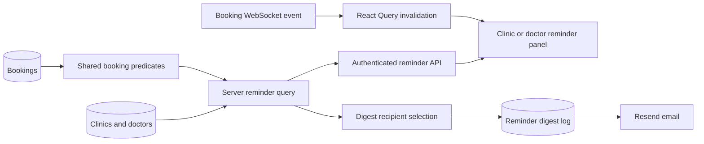

# Reminder Module

## Purpose

The reminder module gives clinic staff and doctors a live view of upcoming
appointments and can send one consolidated daily digest email. Reminders are
calculated from current booking data. They are not notification records and are
not stored in the `notifications` table.

The server is the source of truth for eligibility, role ownership, lifecycle
state, and clinic-local calendar dates.

Related documents:

- [Booking overview and lifecycle](01-booking-overview-and-lifecycle.md)
- [Booking status and lifecycle](03-booking-status-and-lifecycle.md)
- [Booking API and server contracts](11-booking-api-and-server-contracts.md)
- [Reminder implementation plan](../../TODO/09-reminder-module-plan.md)
- [Render environment setup](../../development/render-environment-setup.md)

## End-to-end flow



## Eligibility rules

### Common rules

A reminder appointment must:

- Belong to a real clinic through its slot and clinic relationship.
- Use a slot that is not cancelled.
- Fall on one of the next seven clinic-local calendar dates, including today.
- Not be cancelled or marked no-show.
- Not have a completed or treatment-completed visit.
- Not have a `patient_left_early` visit status.

The policy is implemented in `server/reminder-policy.ts` and reuses the
predicates in `server/booking-predicates.ts`. The client never decides whether
a booking is eligible.

### Clinic visibility

The clinic reminder list is scoped to the authenticated clinic session. It
contains active operational bookings that are confirmed by the clinic booking
flow, including legacy confirmation states accepted by
`isConfirmedBooking()`.

Doctor approval by itself is not clinic confirmation. An appointment with
`doctorApprovalStatus = approved` but no accepted booking confirmation is not
included in the clinic list.

### Doctor visibility

The doctor reminder list is scoped to the authenticated doctor's email. It
contains only appointments where:

- `assignedDoctorEmail` matches the authenticated session email.
- The appointment belongs to a valid clinic.
- `doctorApprovalStatus` is `approved` or `admin_confirmed`.
- The appointment passes the common lifecycle and date-window rules.

A doctor does not receive another doctor's appointments. `admin_confirmed`
means the clinic confirmed the appointment on behalf of the assigned doctor;
it is distinct from ordinary clinic confirmation.

### Digest clinic eligibility

A clinic can receive a daily digest when all of these are true:

- `status = approved`.
- `isArchived = false`.
- `subscriptionStatus = active`.
- The clinic email is present and normalizes to a non-empty address.

Eligible clinics receive a digest even when they have zero appointments.
Inactive, expired, pending, rejected, and archived clinics are excluded.

Doctors receive a digest only when they have at least one eligible appointment.
The doctor address comes from the `doctors.email` record, and appointment
ownership still comes from `bookings.assignedDoctorEmail`.

## Calendar and timezone behavior

The reminder window is seven local calendar dates:

- `nextThreeDays`: local dates 0, 1, and 2.
- `comingWeek`: local dates 3, 4, 5, and 6.
- Date 7 is excluded.

The timezone is read from `clinics.timezone`, with the shared default and
fallback behavior from `shared/booking-status.ts`. The browser timezone and
server timezone are never used to classify an appointment.

Clinic queries calculate exact UTC bounds for the clinic's local date window.
Doctor queries fetch a conservative UTC candidate range, then classify each
appointment using its own clinic timezone. This supports doctors assigned to
clinics in different timezones.

The two groups are created from the same date-group function, so an appointment
cannot appear in both groups.

## Server implementation

### Storage methods

`DatabaseStorage` exposes two live query methods:

- `getClinicReminders(clinicId, now?)`.
- `getDoctorReminders(doctorEmail, now?)`.

Both methods:

1. Join `bookings` to `slots` and `clinics`.
2. Apply server-side ownership conditions.
3. Apply slot cancellation and common lifecycle SQL predicates.
4. Apply the shared in-memory reminder policy.
5. Sort by slot start time and booking ID.
6. Return a safe reminder projection rather than the complete booking record.

The projection contains:

- Booking ID.
- Patient display name.
- Slot start and end times.
- Visit type and treatment category.
- Assigned doctor display name.
- Assigned doctor email.
- Clinic ID, clinic name, and clinic timezone.
- Clinic-local date and date group.

It does not expose descriptions, phone numbers, consent signatures, doctor
notes, clinical records, billing data, or other sensitive booking fields.

### API endpoints

#### Clinic endpoint

```text
GET /api/auth/clinic/reminders
```

Requires an authenticated clinic owner session. The clinic ID is taken from
`req.session.clinicId`; callers cannot provide a different clinic ID.

#### Doctor endpoint

```text
GET /api/doctor/reminders
```

Requires an authenticated doctor session. The doctor email is taken from
`req.session.doctorEmail`; callers cannot provide a different doctor email.

Both endpoints return:

```json
{
  "nextThreeDays": [],
  "comingWeek": [],
  "totalCount": 0,
  "generatedAt": "2026-08-22T06:00:00.000Z"
}
```

Unauthenticated requests are rejected by the shared authentication middleware.
Authenticated sessions with the wrong role receive `403`.

## Client behavior

The shared control is implemented in
`client/src/components/ReminderPanel.tsx`, with data access in
`client/src/hooks/use-reminders.ts`.

### Where it appears

- Desktop clinic header.
- Desktop doctor header.
- Mobile clinic dashboard top bar.
- Mobile doctor dashboard top bar.

Superuser sessions do not receive a reminder control because there is no
product-defined superuser reminder scope.

### Panel states

The control supports:

- Badge count: total active appointments, not unread notifications.
- Loading: skeleton appointment rows.
- Error: readable error message and retry action.
- Empty: calendar icon and seven-day empty-state message.
- Results: separate `Next 3 Days` and `Coming Week` sections.
- Appointment navigation: opens the existing clinic booking detail or doctor
  patient detail flow.

The desktop presentation uses a popover. Narrow screens use a bottom drawer.
The notification bell remains a separate event-oriented control.

### Refresh behavior

Reminder queries use the React Query key `['reminders', role]` and refresh by:

- Initial query fetch.
- Five-minute polling.
- Reminder panel opening.
- Browser `online` events.
- Returning to the visible tab after at least one minute hidden.
- Notification WebSocket connection and reconnection.
- Booking WebSocket events, including confirmation, assignment, approval,
  cancellation, rescheduling, check-in, completion, no-show, early exit, and
  related booking updates.

Reminder invalidation does not create ordinary entries in `notifications`.
Visibility and online listeners are removed when the hook unmounts.

## Daily digest

### Scheduler endpoint

The digest job is invoked by a scheduler through:

```text
POST /api/internal/reminders/digest
x-reminder-job-secret: <REMINDER_JOB_SECRET>
```

This endpoint is not session-authenticated. It requires the configured secret
and compares it using a constant-time comparison. It returns `503` when the
scheduler secret is not configured and `401` for an invalid secret.

The endpoint runs one digest pass and returns counts for dry-run, claimed,
sent, skipped, and failed recipients.

### Recipient selection

`server/reminder-digest.ts` selects:

1. Approved, active, non-archived clinics, including clinics with zero eligible
   appointments.
2. Doctors who have at least one eligible assigned appointment.
3. Normalized email addresses using trim and lowercase.
4. One recipient per normalized address and local digest date.

If a clinic and doctor resolve to the same normalized address for the same local
digest date, their reminder data is combined into one email. Appointment IDs
are de-duplicated before the email is claimed.

### Digest log and idempotency

The `reminder_digest_logs` table is defined in `shared/schema.ts` and created by
`migrations/0001_reminder_digest_logs.sql`.

The log stores:

- Normalized recipient email.
- Recipient role.
- Clinic and doctor IDs where available.
- Local digest date.
- Exact appointment IDs included.
- Template version and content hash.
- Claim, sent, and failure status.
- Attempt, sent, and creation timestamps.
- Failure reason when delivery fails.

A unique index on `(recipient_email, local_digest_date)` makes repeated scheduler
invocations safe. A duplicate claim is skipped before sending.

### Email behavior

The digest template:

- Renders both non-overlapping date groups.
- Renders a clear zero-appointment clinic state.
- Uses only privacy-approved reminder fields.
- Escapes user-controlled values before inserting them into HTML.
- Includes a dashboard CTA from `FRONTEND_URL`.
- Records success only after the Resend call completes.
- Records the failure reason when delivery fails.

Sending is enabled only when the compiled runtime is active
(`NODE_ENV=production`), `RESEND=PRODUCTION`, and `RESEND_API_KEY` are all
available. Both deployed Production and deployed Development use this
configuration and send to their configured real recipients. Local development
and automated tests remain dry-run.

## Deployment configuration

The application-side implementation is complete, but production activation
requires platform configuration:

1. Apply the reminder digest migration to the Supabase database.
2. Set `REMINDER_JOB_SECRET` on the Render backend service.
3. Verify `RESEND_API_KEY`, `RESEND`, and `EMAIL_FROM`.
4. Verify the sender domain when using production Resend delivery.
5. Configure Supabase `pg_cron`/`pg_net` or a Render Cron Job to call the
   protected endpoint once each morning.
6. Use an HTTPS backend URL and send the secret in the
   `x-reminder-job-secret` header.
7. Run authenticated clinic and doctor browser checks against Render.

Do not add an in-process `setInterval` scheduler to the web service. Render
instances can restart or sleep, while the digest log must remain durable in
Supabase.

## Verification

Local checks currently available:

```text
npx tsx --test server/*.test.ts shared/*.test.ts
npm run check
npm run build
git diff --check
```

The pure tests cover booking eligibility, lifecycle exclusions, assignment,
local-date boundaries, timezone differences, digest rendering, HTML escaping,
zero-appointment output, email normalization, and stable content hashes.

The following checks require a configured database and deployed environment:

- Concurrent digest claims against Supabase.
- Actual Resend delivery and failure handling.
- Scheduler authentication from the configured cron service.
- WebSocket reconnect and long-idle browser refresh behavior.
- Responsive clinic and doctor dashboard interaction on Render.
- Full end-to-end verification of lifecycle changes removing or moving reminder
  items.

The current implementation should be treated as deployment-ready application
code, not as proof that the external scheduler, database migration, email
provider, and production browser flows have been activated.
